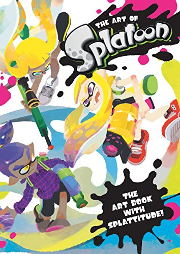
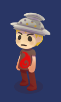
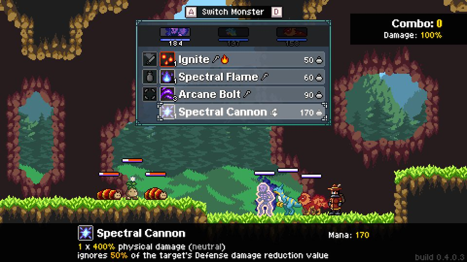
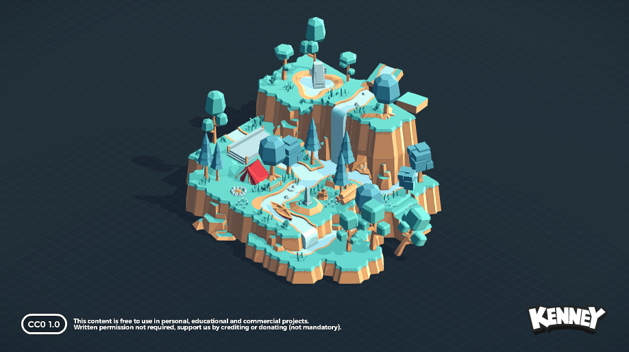
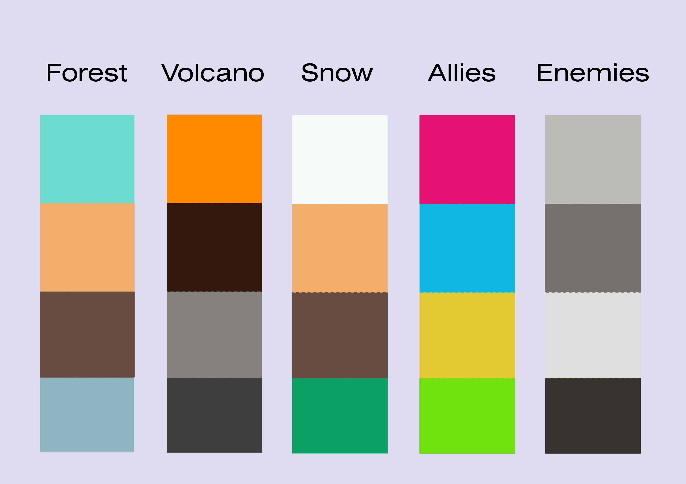
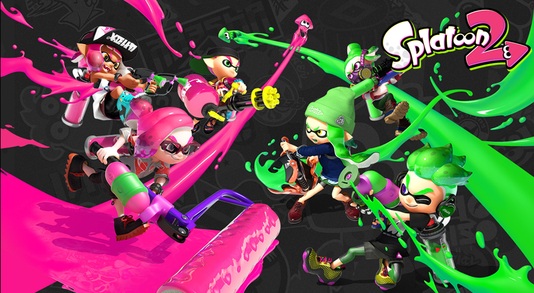
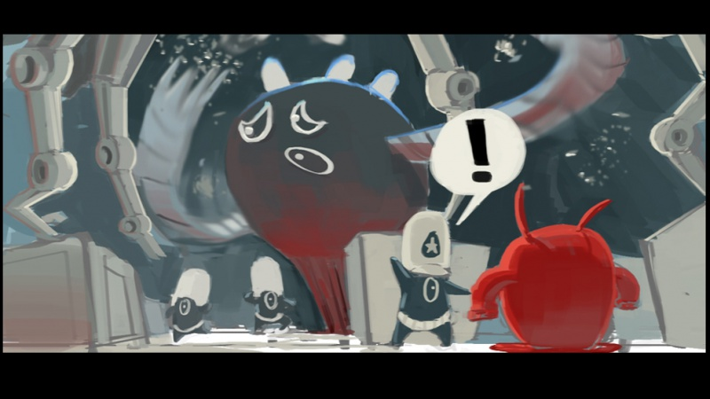
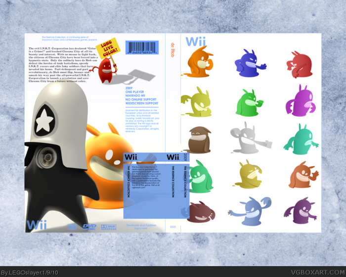
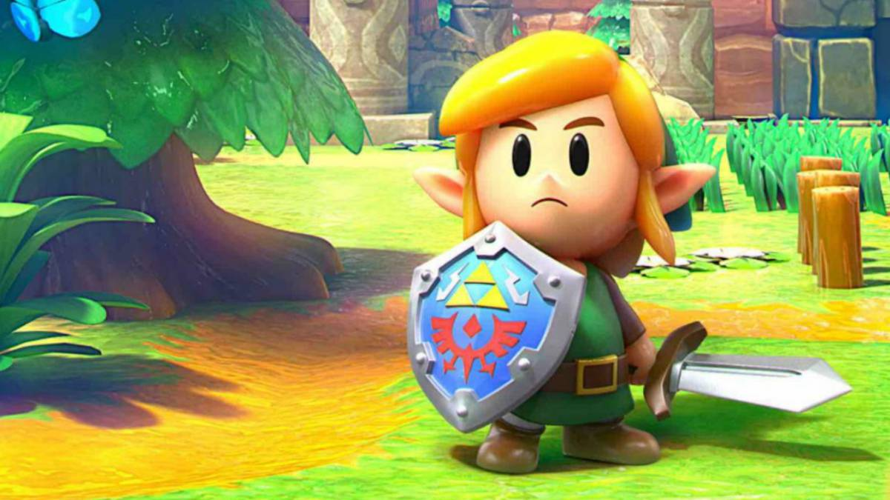
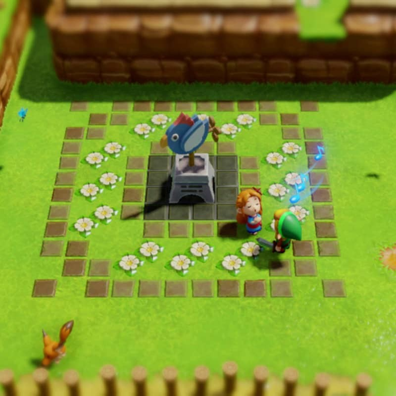

# ART BIBLE DOCUMENT

***

## Main Index

+ [Mood](ArtBible.md#mood)
  - [Art Style](ArtBible.md#art-style)
  - [Character Art](ArtBible.md#character-art)
  - [Level of Detail](ArtBible.md#level-of-detail)
  - [Camera](ArtBible.md#camera)
  - [Scale](ArtBible.md#scale)
  - [Scenarios](ArtBible.md#scenarios)
  - [Color Palette](ArtBible.md#color-palette): [Visual Hierarchy](https://github.com/Needlesslord/BrainDeadStudios/blob/master/Docs/ArtBible.md#visual-hierarchy)
  - [Atmosphere](ArtBible.md#atmosphere)
  - [UI](ArtBible.md#ui): 
  - [References](ArtBible.md#references)

+ [Art Used](https://github.com/Needlesslord/BrainDeadStudios/blob/master/Docs/ArtBible.md#art-used)

+ [Concept Art](https://github.com/Needlesslord/BrainDeadStudios/blob/master/Docs/ArtBible.md#concept-art)

+ [Technical Guidelines](https://github.com/Needlesslord/BrainDeadStudios/blob/master/Docs/ArtBible.md#technical-guidelines)

+ [Credits](https://github.com/Needlesslord/BrainDeadStudios/blob/master/Docs/ArtBible.md#credits)

***

## Mood

The mood of the game will be irreverent, cutesy, carefree and laid back. However, it will also present a foreign factor to it with a more "post-urbanistic" appeal to the environment. Both the paint gimmick and art inspiration are taken from Nintendo's Splatoon, without taking the more urban and contemporary parts.

### Art Style

The Art Style we're going for is Cartoon, as in simplistic, colourful and irreverent. The main focus in the art department is to make the game feel like a fun and relaxing experience. This choice also makes it easier for the team to adapt open art so that it fits the story more easily.

These are some examples of games with similar styles:

### Character Art

The different playable troops will have similar designs, with the only change being clothing and weapon. These designs will be colourful and simple, as dictated by the art style.

For the different foes faced, however, sprites will be monochromatic and stay within the grey scale except for one feature in their design that will keep the "original" color, to set the enemies apart.

### Level of Detail

Since the resources are scarce and the art style has been chosen accordingly, the level of detail / complexity of the art will be pretty low. Not a great amount of time should be inverted in the art department since it will not be evaluated. We should also take into account the fact that the game will mostly use open art, either as downloaded or edited.

Knowing this, all assets should only aim to cover these points:
+ Appealing
+ Coherent with the Narrative and Gameplay
  + Paint-Related
  + Fills its in-game purpose
+ Coherent with the rest of the Art
  + No hard lines
  + Minimalistic Design
  + Isometric

The art should be homogeneously detailed as in a 2D RTS game there aren't really background and forefront assets or textures that could be hidden. An example of homogeneous and effective but low-detail game art:

  
  
### Camera

The Camera will be located above the game map, placing it in an isometric perspective. There will be free traslation of the camera but no rotation, since the game is 2D. Unexplored terrain, though, will be covered by the Fog of War. An example of a game with a similar Camera would be They are Billions.

### Scale

The different maps will be formed by 151 * 107 isometric tiles (to be determined) as the minimum amount of space anything can fill. The scale will not be realistic but it will keep logical real life standards: ally troops will mostly occupy one tile, buildings will occupy rectangles of minimum 2 * 2 tiles and enemies will range from filling one tile to several depending on their importance (boss).

### Scenarios

There will be only one scenario where each game takes place. The scenario will represent one of the three different maps to be made in Tiled, using different Tilesets. The scenarios, as said before, will be Isometric and in cartoon style. The tiles and assets should have a 3D feel while being composed of simple shapes and colors to be coherent with the style. 

(The following picture is a sample to be replaced by our actual scenarios when finished)

### Color Palette

This will be the main color palette of the game, used for the Logo, UI and menus:

(Under Construction)

#### Other Palettes:

Each map will have different color palettes in order to achieve a different ambientation. However, the color palette of the ally troops will stay the same. The enemies will always be colored in the scale of grey. These are (except for enemies) pretty saturated palettes, as the art style demands.

#### Visual Hierarchy

This way, the eye of the player will always go to the brightest and different colors, the ally troop, which will make the management of units easier. The different buildings will also have the same colors in all maps so that they are recogniseable for the player, leaving cohesive and similar hued environments that don't get in the way of the action. Enemies, while monochromatic, will have different colored details so that the player doesn't mix them together and their attention is brought to them.

### Atmosphere

As stated before, each map will have its own individual feel that goes with a certain playing style. However, the whole game will share most of the visual assets, and so, will have a certain atmosphere. The aim of the art in this sense will be to have a laid back, colorful and fun atmosphere that keeps just enough tension and aggressive elements so that the player can't be completely passive.

(In-game screenshot to be added)

### UI

To know more about our GUI design, layout, sprites, etc. please go to the [GUI Document](https://github.com/Needlesslord/BrainDeadStudios/blob/master/Docs/GUIDocument.md).

### References

The artistic inspiration for this game comes from games like:

+ Nintendo's Splatoon (colors & concept)
  
  
  

+ Blue Tongue's De Blob (colors, concept & art style)
  
  
  

+ Ensemble Studios' Age of Empires (isometric, tiles, reference within the genre)
  
  

+ Nintendo's Legend of Zelda Link's Awakening 2019 (art style)
  
  

***

## Art Used

### Ally Units
  
  
  
### Enemy Units

### Buildings

### Map

### UI Elements

### Backgrounds

### Fonts

### Logos

***

## Concept Art

For our project we are not going to use original sprites, therefore, we will not be making any concept art apart from the general [style](ArtBible.md#art-style) ideas and [references](ArtBible.md#references), which you can check out above.

You can check out [here](https://splatoonwiki.org/wiki/Concept_art) if you want to see what the concept art for Splatoon looks like.

***

## Technical Guidelines

### Format

+ Spritesheets and tilesets will be exported in .png format.
+ Format for video files will be decided after the lecture about Video Rendering is done.

### Software

+ We will use Adobe Illusrator CC 2019 to create any icons or logos (team use rather than in-game)
+ We will use Adobe Photoshop CC 2019 to edit/create sprites
+ We will use ToonBoom Harmony Premium to make the intro animations.

***

## Credits

+ [Ally Troops Sprites](https://erikari.itch.io/elements-supremacy-assets)
+ [Background Tileset](https://www.kenney.nl/assets/nature-kit)
+ [Buildings](https://www.kenney.nl/assets/fantasy-town-kit)
+ [Enemy Sprites - Slime](https://stealthix.itch.io/animated-slimes)

***

