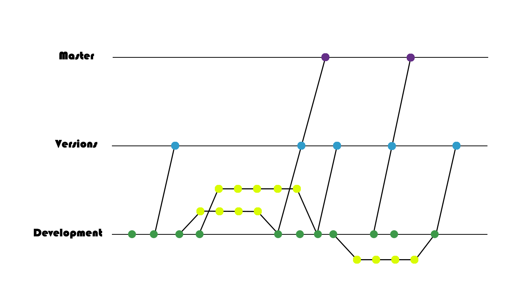

# TD DOCUMENT


***


## Main Menu

+ [Introduction](TDD.md#introduction)

+ [Technical Goals](TDD.md#technical-goals)
  - [Target Hardware](TDD.md#target-hardware)
  - [Performance Budgets](TDD.md#performance-budgets)

+ [Development Tools](TDD.md#development-tools)
  - [Development Hardware](TDD.md#development-hardware)
  - [Development Software](TDD.md#development-software)
  
+ [Game Mechanics](TDD.md#game-mechanics)
  - [Technical](TDD.md#technical)
  - [Architecture](TDD.md#architecture)
  - [Graphics & Sound](TDD.md#graphics-and-sound)
  - [Artificial Intelligence](TDD.md#artificial-intelligence)
  - [Logic](TDD.md#logic)
  - [Physics & Collisions](TDD.md#physics-and-collisions)

+ [Coding Style](TDD.md#coding-style)
  - [Naming Conventions](TDD.md#naming-conventions)
  - [Braces](TDD.md#braces)
  - [Variables](TDD.md#variables)
  - [Functions](TDD.md#functions)
  - [Enums](TDD.md#enums)
  - [Loops](TDD.md#loops)
  - [Conditionals](TDD.md#conditionals)
  - [Classes and structs](TDD.md#classes-and-structs)
  - [XML](TDD.md#xml)

+ [UML](TDD.md#uml)

+ [Data Layout]()

+ [Version List](TDD.md#version-list)
  - [Planned](TDD.md#planned)
  - [Real](TDD.md#real)
  - [Scheduling]()

+ [Build Delivery Method](TDD.md#build-delivery-method)


***

## Introduction

"Paint Wars" is an isometric single player RTS game featuring a campaign with playable units, buildable structures and manageable resources where the player will have to fight against waves of enemies trying to destroy their base. The language used will be C++. For more about the game check out our [GDD](GDD.md).

#### Development Team:

[Nuria Lamonja](https://github.com/Needlesslord)
+ Team Leader, Management

[Tomás Carreras](https://github.com/tomascarreras1000)
+ Technical Director

[Marc Ariza](https://github.com/MarcArizaAlborni)
+ Design Director

[Enric Durán](https://github.com/EnricGDV)
+ Art Director

[Álex Lopez](https://github.com/AlexLA99)
+ QA Director

[Marc San José]()
+ Coder, Designer

***


## Technical Goals


### Target Hardware

The following table represents the different specifications considered for the target platform (data extracted from the laptops in class):

|     Hardware    |             Requirements             |
| --------------- | ------------------------------------ |
|       CPU       |  Intel(R) Core(TM) i7-9750H @2.60GHz |
|       GPU       |       NVIDIA GeForce RTX 2060        |
|       RAM       |                16GB                  |
| Free Disk Space |                100MB                 |
|       OS        |         Windows 10 Enterprise        |

### Performance Budgets

Performance Budgets are directly linked to the Target Hardware's specifications. For out specific case, as the target hardware properties surpass overwhelmingly the amount of content that we can provide for the GPU and CPU to handle (2D Sprites, not enormous amounts of information...), the only precaution advised would be eliminating any possible memory leaks that could overwork the RAM.

***


## Development Tools

### Development Hardware

The following hardware equipment will be needed for production:
+ 6 Personal/Laptop Computers with the following minimum Specs (data extracted from minimum Specs required for Photoshop):

    |     Hardware    |             Requirements             |
    | --------------- | ------------------------------------ |
    |       CPU       |          Intel(R) Core(TM) i3        |
    |       GPU       |       NVIDIA GeForce GTX 1050        |
    |       RAM       |                 4GB                  |
    | Free Disk Space |                 1GB                  |
    |       OS        |         Windows 10 Enterprise        |
    
+ At least 1 wacom graphic tablet or iPad for the whole team, in case it is needed for any purpose in the art department such as logo, sprites... (can be rented at university)
+ At least 1 Xbox Gamepad (can be rented at university)

### Development Software

The following software must be installed before production:
+ Microsoft VisualStudio 2017 (coding)
+ **GitHub** (work environment, cloud storage facility, QA, CD + CI)
+ Tiled 0.17 (maps)
+ Adobe Photoshop (Art making/editing)
+ Adobe Illustrator (Logo making/sketching)
+ ToonBoom Harmony (Animation)

#### External Libraries

+ SDL 2.0.10
+ pugixml 1.10

#### GitHub Commit Naming:
Every commit should follow the following structure: Area of work + space + work done

#### GitHub Branching:
GitHub offers a feature for branching your projects in order to have a more clear and divided workspace. This feature is very useful for having different coders working in the same project without stepping on each other's toes and keeping their work divided. We will apply the following branching model:



The master branch will be where the commits for the 4 main releases of the game will be allocated.

The versions branch will have the different milestones / sets of features that the team agreed to implement in the game.

The development branch will be the main working branch where every change implemented to the game is seen. However, smaller branches will appear so that unfinished work and uncomplete features can be uploaded without breaking the main branch and the code the rest of the team is working with. These smaller branches will also be useful for bug fixing and experimentation.


***


## Game Mechanics

### Technical

**The game will include the following features:**
+ Screens transitions
+ God Mode
+ Assets/Resources Loaded from a ZIP
+ Automatic CI + CD
+ Animated Logo Intro with Audio
+ Main Title Screen with Main game Menu, Animations, Audio and Responsive UI
+ 6 Resources
+ 11 Types of Buildings
+ 4 Types of Playable Units
+ 10 Types of Enemies
+ At least 4 Quests
+ At least 5 Particle Systems
+ Group Movement
+ Fog of War
+ Gamepad & Keyboard/Mouse Inputs
+ Responsive Pause Menu with lower Music Volume
+ Minimap
+ Responsive Interface
+ In-game fx and music tracks specific for each screen and fade-in/fade-out
+ Animated Victory/Lose Screen with Audio

Order of application can be checked in the [Version List](TDD.md#version-list)

### Architecture

The Game's Flow Diagram can be found in the [GUI Document](GUIDocument.md#menus-flow-diagram).

#### Data Management:

The game will have a save button in the pause menu so that players can save a game whenever they need to and there will be an option to continue playing the last unfinished game in the main menu.

### Graphics and Sound

#### Graphics:

Spritesheets will be stored in the [sprites](https://github.com/Needlesslord/BrainDeadStudios/tree/master/Source/Resources/sprites) folder in [Resources](https://github.com/Needlesslord/BrainDeadStudios/tree/master/Source/Resources) each contain a certain entity's sprites and will be divided by rows in different animations, which will have the sprites properly alineated and equally separated (in the case the entity is animated). In the case of tiles and background sprites, tilesets will be stored with maps and feature every tile needed for a certain map. Each one of the spritesheets and tilesets will be stored in .png format and a resolution that is multiple of 1080p * 1080p.

#### Sound:

Audio files will be stored in the [audio](https://github.com/Needlesslord/BrainDeadStudios/tree/master/Source/Resources/audio) folder in [Resources](https://github.com/Needlesslord/BrainDeadStudios/tree/master/Source/Resources). There will be a division between [fx](https://github.com/Needlesslord/BrainDeadStudios/tree/master/Source/Resources/audio/fx) and [music](https://github.com/Needlesslord/BrainDeadStudios/tree/master/Source/Resources/audio/music), which will be stored in .wav and .ogg format respectively.
We will be using, then, two different channels, one for music that will be reproduced constantly and one for fx that will only be used when some action is triggered.

For more information check out our [Art Bible](ArtBible.md) and [Audio Bible](AudioBible.md).

### Artificial Intelligence

Artificial Intelligence will be limited and managed through the Entity System. *(To be specified in more advanced stages of production)*

### Logic

In the following UML you can see how the Entity System will work:


### Physics and Collisions

In a 2D Isometric RTS Game there are is no need for a Physics System per se, however, interactions between entities will be defined through a tiles system where occupied tiles will be labeled as unwalkable and have different interactions that depend on the type of entity they are hosting. *(To be specified in more advanced stages of production)*

***


## Coding Style

### Naming Conventions

+ Everything will be written in english, including comments.

+ Blank spaces will be left for clarity and a better understanding of the code as much as needed:

```
for (uint i = 0; i < n; i++)
```
+ Comments will always leave a space between the two bars and the actual comment:

```
// Comment
```

### Braces

+ Braces will be opened in the same line as the declaration finishes.

+ Braces will be closed in the line after the last line of filling.

```
void BraceUse(){
// Filling here
}
```
+ Braces will be avoided if the filling is only one line or less

```
while (isOpen)
        doSomething();
```

### Variables

+ Simple variables will all be lowercase:

```
uint heath
```
+ Compound variables will have all the words but the first starting with capital letters:

```
uint numEnemies
```
+ Generic variables will have the same name as their class/struct/etc.:

```
Enemy* enemy
```
+ Variables should not try to be as short as possible but rather they should be able to be understood out of context:

```
uint numEnemiesWave01
```
+ This will not be the case, however, for temporal vairbales:

```
uint i
```
+ Bools will start with the prefix is- in order to interpret more clearly it's current state:

```
bool isActive
```

### Functions 

+ Functions will have all their words starting in capital letters and will have no spaces among them:

```
CallNextWave()
```

### Enums 

+ Enums will be written all upper case with underscores to separate words in both enum declarations and their items.

+ All items will have at least the first word in common with the enum:

```
PAINT_SOLDIER_STATES
```

```
PAINT_SOLDIER_IDLE
```

### Loops

+ For iterator variables we will use i and, in case of need, j, k, etc.
```
for (uint i = 0; i < n; i++) {
      // Do something
}
```

### Conditionals

```
if (something)  
      // Do something
      
else if (somthing else)
      // Do something else
      
else 
      // Something else
```

+ In the case a parenthesis is too long it should be split in two or more lines after a comas, operators and operands but never after the >/=/< operators:

```
if(player.x < object.x && player.x + player.w > object.x &&
player.y < object.y && player.y + player.h > object.y)
```

### Classes and structs

+ Structs will be used to store data.

+ The naming for the classes will follow the same rules as the functions.

+ Classes will always follow the same structure:

```
  Class ExampleClass {
public:
  // Constructor and destructor
  // Methods
private:
  // Methods
public: 
  // Variables
private:
  // Variables
  
};
```

### XML

+ For the XML we will use the standard coding convention.

***


## UML


The overview of our code is provided in the following UML. This structure, however, is very likely to change, evolve or be extended during the development.


#### GENERAL UML


#### ENTITIES UML

***


## Version List


### Planned


### Real
  
*TO BE DELIVERED AT THE END OF THE PROJECT AND UPDATED DURING THE DEVELOPMENT*

### Scheduling

You can check this information in the [GDD Document](GDD.md).


***


## Data Layout

The Data Layout was provided by the teacher in a template from which the GitHub Repository was created and is structured as shown below, together with the format in which every file should be stored:

+ Repository
  + Docs
      + ArtBible.md
      + AudioBible.md
      + GDD.md
      + GUIDocument.md
      + ProductionPlan.md
      + QAWorkflow.md
      + TDD.md
      + README.md
  + Screenshots
    + .png
  + Source
    + Deps
      + src
        + .hpp
        + .cpp
      + readme.txt
    + Resources
      + Audio
        + Fx
          + .wav
        + Music
          + .ogg
      + Fonts
        + LICENSE.txt
        + .tff
      + Maps
        + .tmx
      + Sprites
        + .png
      + config.xml
    + Game.vcxproj
  + LICENSE.md
  + Project.sln
  + README.md
  + RRSS.md
  
#### File Naming Conventions:
Even though there may be certain specific conventions for each type of files, the general naming conventions should be the use of     underscores to separate words and use of capital letters af the start. The logical naming hierarchy should go from general to particular. (i.e. tiles_terrain_grass.png)

***


## Build Delivery Method

We will be using GitHub Actions as a Continuous Integration tool to test our code every important feature commit in the Development branch in order to prove that it is functional in every possible environment in the [Target Platform(s)](TDD.md/#Target-Hardware). There will be a release for every one of these commits in GitHub.

***
