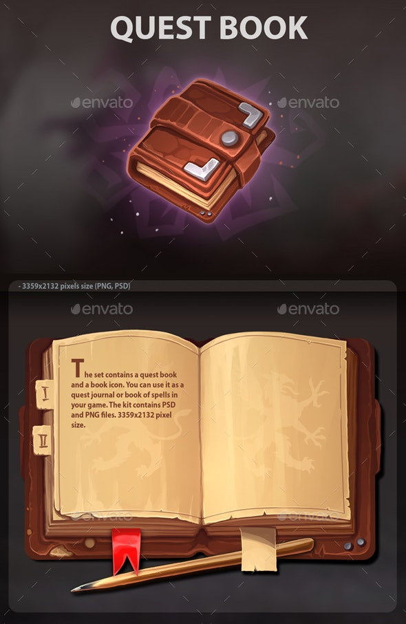
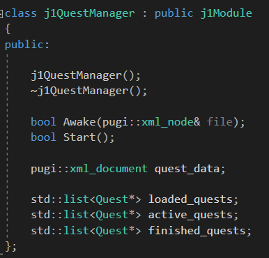
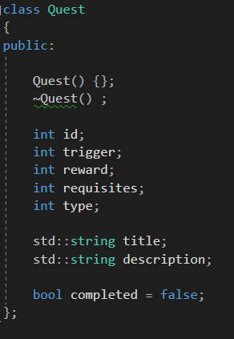
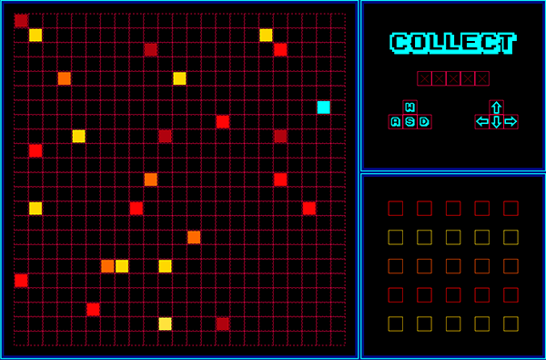
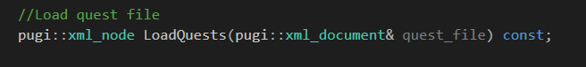
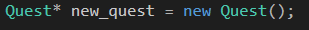

## Welcome

 Hi! My name is [Guillem Turmo Gonzalez](https://www.linkedin.com/in/gturmo/) and this is a Research Project about a Quest Manager I did as a student of the Bachelor's Degree in Video Games by UPC at CITM. This content is generated for the second year's subject Project 2, under supervision of lecturer [Ramon Santamaria](https://www.linkedin.com/in/raysan/). 
 
 

## What I'll be talking about

My Research Project consists on how to implement a proper Quest Manager into a videogame using the SDL & STL libraries. In order to do so, we firstly need to understand what is a quest and what involves managing them. Therfore we will be taking a quick look at:

#### Quests Variation

- Simplicity: complexity of the quest's logic and systems involved

- Linearity: Multiple Solutions or linear quests

- Capacity: amount of quests

- Generation: Predefined quests or random

- Modularity: Grouping quests or Unique quests

#### Event System
- How do we track if quests are being completed or not

#### Data Driven quests
- How do we implement new quests in our game

#### How do we implement our own Quest Manager
- There's a list of TODO's that I encourage you to do in order to hopefully acquire a simple example of a well functioning Quest Manager

## Introduction

#### Why do we need a Quest Manager?

You might have been thinking about that project you've had in mind for a while and all of the cool things you want to implement, but you might have overlooked that making a mix of a sandbox RTS and a fighting game was a bit too much for your scope. Therefore you realize your game needs some simple mechanics that keep the player engaged and entertained. There's where the quests come in, which might sound a bit simple to you but actually they are one of the most important core elements of the most iconic videogames of history. 

Many people might not agree, they may tell you that lots of huge games came out without any kind of quest system, and even though there's always exceptions, they would be surprised of how far from reality they are. And that's because the beauty of quests is that they can appear in many different forms. Some designers lean towards a more visible quest system where you literally own a _Mission book_ that shows thousands of different quests to unlock. 

However, others tend to implement a more subtle system where you won't even feel like you are following a set of quests. And that is because Quests are such a key element in video game design and development that is really hard to avoid them. Instead of doing that, you should try to take the most benefit out of a well designed Quest Manager. Here are a few things you should take into account while brainstorming about how you want your Quest System to be like:

- Simplicity: when talking about simplicty, you need to think about what kind of logic will your quests have and with how many other systems will they interact. A really important factor when developing a quest system is to prepare it to be adaptable with working along other system such as a _Dialog System, an Event System, NPC's, the GameWorld, etc_

- Linearity: another aspect that should be considered is linearity, meaning whether or not your quests will have a mandatory order or the player will be able to walk a bit more freely throughout the game story. For example, you might not want a fully narrative-free story where the player can take the story anywhere but still want the player to feel in control, in that case you might wanna implement multiple solutions that take you to the same or similar endings.

- Capacity: how many quests are you planning on implementing in your game? will it be a fully quest-based game where they take the main role or will you just have a few as a gameplay support?

- Generation: when designing a Quest Manager, you also need to take into account how are your quests generated. You might either want to have a more wide range of randomly generated quests or have them be predefined by you, which takes us to next and final point

- Modularity: it refers to how we group our quests since we can have two types of them: grouped and unique
   - Grouped: we can divide quests in types such as _Gather, Kill, Escort, Interact, Hybrids, etc_ since they have similar behaviours, therefore allowing us to group them and being able to create similar ones from one template
   - Unique: these are usually used as special narrative-decisive quests where the quest itself may have many other side-quests that you must complete in order to take on the main one

## Implementing a Quest System

After that short introduction, I'm sure you must be expecting the Quest Manager to be a real challenge, however the core basic Quest manager it would actually look something similar to this, which is basically manages an xml file from where we will get our quest data, and three lists to store and organize quests as they get loaded, activated or done.

_Quest Sytem Structure_ 

We then also have a simple object _Quest_ with some of the info you might need when interacting with other systems

 

_Quests Structure_

One last thing to comment before getting with the TODO's, I've mentioned many times that the Quest System interacts with many different systems, that's why we will also usually create an Event System that is able to track the different events that happen in the game and is in charge of transferring all of that information to the quest system. However, you won't find a structured Event System in this project since I opted for a more simple and visual way of understanding a quest system. Once said that, let's head over the TODO's

## TODO

The environment I chose for the project is a simple but yet very visual game that consists of a _player (blue square)_ that can move using WASD or the arrows. Its mission is to collect different fruits from the board (5 different types of fruits, Cherries, Bananas, Oranges, Watermelons and Mangoes). The main goal of the game is to earn five achievements completing quests

We'll be working mainly on the QuestManager module and header but we will also use the App and the Scene modules, therefore you can ignore the rest since their only purpose is to support the game context and not the research itself

### TODO 0

- Start by taking a look at the basis I showed you above and make sure you understand the elements of the Quest System Structure and the Quests. This should only take a moment but it's crucial to keep up with the rest

### TODO 1

- Once you've understood this, take a bit more time to read and observe the syntax of the xml that we will be using to load the data called quest_data

### TODO 2

- All of our data will be parsed from that XML, therefore we need to create a new function in the App that will read and load that XML for us

### TODO 3

- Now that we have the XML loaded, we'll begin loading all of the info into our Quest Manager. Remember to use the LoadQuest function we just created and to use the proper syntax. We will code a loop that creates a new_quest and loads all of its info for every quest on the XML

### TODO 4

- Right now, we are creating the Quests but we are not storing them properly, therefore after every loop we will push them into the loaded_quests list, however if a quest's trigger is equal to 1 (meaning that is always active) we will directly put those into the active_quests list

### TODO 5

- Now that we have our base working, it's time to implement it with the context, therefore we are gonna create a simple function that checks the events that we are interested in. The skeleton is already implemented, therefore you will only need to create a loop that will iterate the active_quests list and checks those conditions

### TODO 6

-  We are almost done, we are currently correctly checking the active_quests list but we aren't doing anything with a quest once it's completed, therefore we need to transfer the complete quests to the finished_quests list
  
### TODO 7

- As the final TODO, just take a look at how we are only drawing an achievement (quest completed) once they are in the finished_quests list. I'd also like you to take a look at how we make the 4th achievement a different quest by forcing the player to complete the side-quests in a particular order

## Thanks!!

## Interesting Links
- [Playlist](https://www.youtube.com/playlist?list=PL4G2bSPE_8umJfOuXxut28OQyIliW2Pfp)
- [Documentation](https://www.youtube.com/watch?v=QPOu4hIRCko&list=PLlOitY0Isb1qMfO2qXY_QxoDuax037ghb&index=26&t=323s)
